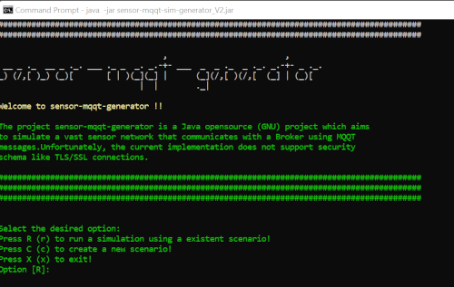
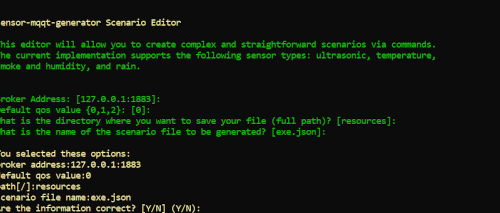
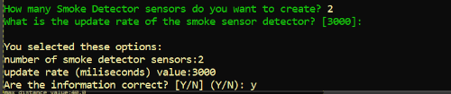
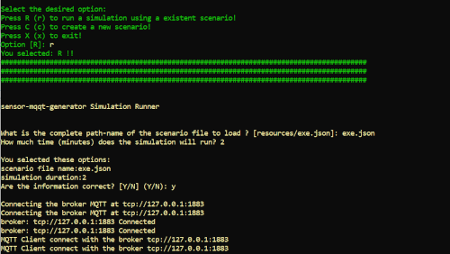

# sensor-mqqt-generator (V2)

The project <b> sensor-mqqt-generator </b> is a Java project which aims to simulate a vast sensor network that communicates with a Broker using MQQT messages. Unfortunately, the current implementation does not support security schema like TLS/SSL connections.

The second version has multiple changes:
- A new iterative shell menu to simplify the scenario development;
- A simplistic script to generate the jar files and its dependences (using maven)
- Support to multiple IoT devices (temperature, ultrasonic, smoke detection, and humidity and water detection).

**The files generated in the oldest version (v 1.0) are not supported by this new version (v 2.0).**

<b>MQTT (MQ Telemetry Transport)</b> is a lightweight messaging protocol designed for high-latency, low-bandwidth, and unreliable networks. It consumes very little power on the device it’s running on, and it works well over unreliable networks.

The MQQT protocol has these main features:
-	Quality of Service Levels: A Quality of Service (QoS) level is simply an agreement between the sender and receiver of a message that guarantees the deliverability of said message.
-	Persistent Sessions
-	Last Will: A "last will" message is automatically sent to the MQTT broker if the client ungracefully disconnects. This allows the broker to notify the other clients easily and efficiently when one disconnects.

# Compilation Process and JAR file Generation

**Basic Directions**
- The compilation of process is quite simple, as the project uses Maven.
- The requirement to the simulation compilation is the **Java 15**.
- The easiest way to compile the project is using the Eclipse IDE.

**Compilation Instructions**
- Go to the root folder (**folder wich contains pom.xml**)
-  run the maven package command:**_mvn package_** 
- if the compilation process worked, a new folder (target) is created with the jar file and a group of folders (ex.: dependency-jars).
- if the compilation process did not work, compile using Eclipse; please visit:
    - How To Create and Run Maven Project with Eclipse and CommandLine: https://www.youtube.com/watch?v=HmF3yQ_nj5Q
    - How To use Eclipse: https://www.youtube.com/watch?v=H35w2V2V-Nk

# Start the Simulation
Inside the target folder (created by the compilation process), run following command: **_java -jar sensor-mqqt-sim-generator_V2.jar_**.

# Creation of Scenario
- Select the option **_C_**.
- Define the broker address
- Define a default qos value (this value will be used by all nodes in your experiment).
- Define a **full path** (folder) to save the simulation file (remember to set the correct delimitator based on your operating system)
    - _Remember the path needs to exist!_  
- Define the name of the simulation file (just the name and remember to save as a json file)
- Check the information and confirm (**_Y_**)

**_Configuration of Ultrasonic Sensors Experiment_**
- Define the number of ultrasonic sensors that you want to simulate
    - _If you define 0 or a negative number, your experiment does not have any ultrasonic sensors!_  
- Define the max  distance measure (cm) read by the sensor.
    - _For example, in the project, if you want to simulate a trash can that has 90 cm of height, the maximum distance is 90!_  
- Define the minimum distance measure (cm) read by the sensor.
- Define the update rate in microseconds (ms): it defines the period your sensor will send updates to the broker.
- Check the information and confirm (**_Y_**)

**_Configuration of Temperature Sensors Experiment_**
- Define the number of temperature sensors that you want to simulate
    - _If you define 0 or a negative number, your experiment does not have any temperature sensors!_  
- Define the max temperature measure read by the sensor.
- Define the min temperature measure read by the sensor.
- Define the update rate in microseconds (ms): it defines the period your sensor will send updates to the broker.
- Check the information and confirm (**_Y_**)

**_Configuration of Smoke Detector Sensors Experiment_**
- Define the number of smoke detector sensors that you want to simulate
    - _If you define 0 or a negative number, your experiment does not have any smoke detector sensors!_  
- Define the update rate in microseconds (ms): it defines the period your sensor will send updates to the broker.
- - Check the information and confirm (**_Y_**)

**_Configuration of Rain / Humidity Detector Sensors Experiment_**
- Define the number of rain / humidity detector sensors that you want to simulate
    - _If you define 0 or a negative number, your experiment does not have any rain / humidity detector sensors!_  
- Define the update rate in microseconds (ms): it defines the period your sensor will send updates to the broker.
- Check the information and confirm (**_Y_**)

**_Configuration the sensors place_**
- Define the latitude of the central point of devices
- Define the longitude of the central point of devices
- Define the maximum distance (meters) where a sensor can be than the central point
    - _The simulator will generate randomly the simulate devices using the central point and the maximum range to define its position!_
    - _To define this parameters, consider the below Figure (based on the Google Maps). It represents the Santa Fe campus of Tecnologico de Monterrey. You can use Google Maps to discovery the coordinates of the central point.   
- - Check the information and confirm (**_Y_**)

# Run a Created Experiment
- Select the option **_R_**.
- Define a **full path** (folder and file) where the simulation file is persisted (remember to set the correct delimitator based on your operating system)
- Define the amount of time (**minute**) that you desire to your experiment.
- Check the information and confirm (**_Y_**)

